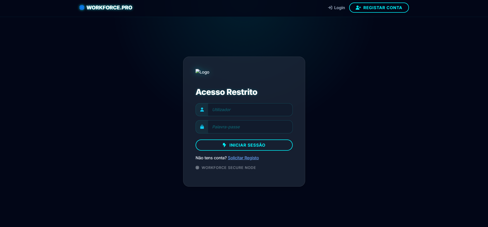
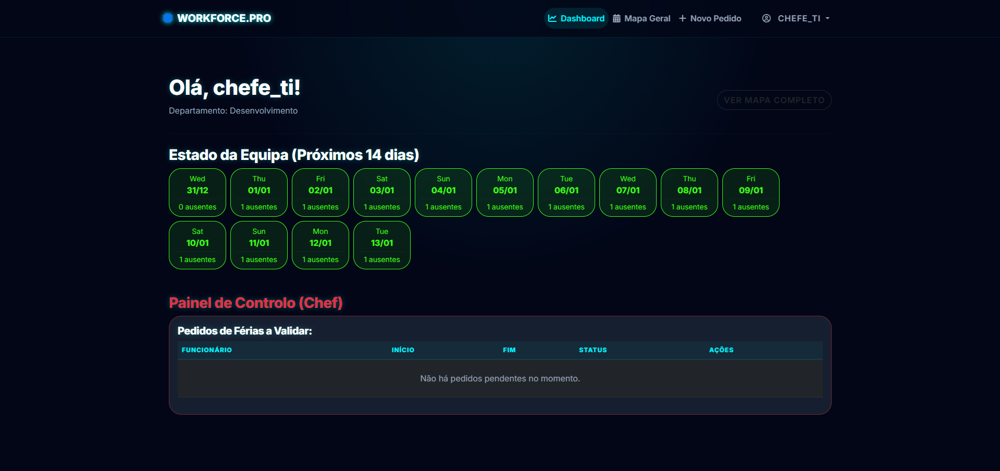

# <p align="center">🚀 Workforce Pro - Management System</p>

<p align="center">
  
</p>

<p align="center">
  <strong>Uma solução de gestão de escalas e férias com estética Cyber-Tech, construída para máxima eficiência operacional.</strong>
</p>

<p align="center">
  
  
  
  
</p>

---

## ⚡ Sobre o Projeto

O **Workforce Pro** é um sistema de gestão de recursos humanos desenvolvido para departamentos técnicos que necessitam de uma visão clara e futurista da sua capacidade operacional. Fugindo ao design corporativo tradicional, a aplicação utiliza conceitos de **Glassmorphism** e **Neon Glow** para criar uma interface imersiva e funcional.

## ✨ Funcionalidades Chave

### 🛡️ Segurança e Controlo de Acesso (RBAC)
* **Validação de Nós:** Novos utilizadores são registados como "Inativos" por padrão.
* **Aprovação Manual:** O acesso ao sistema só é concedido após a validação explícita de um Chef de departamento no Painel de Controlo.

### 📊 Dashboard de Inteligência Operacional
* **Análise de Conflitos:** Projeção visual dos próximos 14 dias com contagem de ausentes por data.
* **Alertas Críticos:** Identificação automática de datas com capacidade reduzida (mais de 20% da equipa ausente).

### 🗺️ Mapa Geral de Turnos
* Visualização em grelha completa de todos os funcionários e respetivos turnos/férias.
* Atribuição rápida de turnos (Manhã/Tarde) via formulário administrativo.

---

## 📸 Screenshots do Sistema

### 🔐 Acesso Restrito (Login)
Interface com efeito de vidro e brilho neon ciano para autenticação segura.


### 📈 Painel do Chef
Visão geral da equipa, pedidos pendentes e calendário de conflitos.


---

## 🏗️ Arquitetura Técnica

A aplicação segue o padrão **MVT (Model-View-Template)** do Django:

* **Models:** Estrutura robusta utilizando o `AbstractUser` para perfis personalizados e `ForeignKey` para gestão de departamentos e pedidos.
* **Views:** Lógica de negócio otimizada para cálculos de disponibilidade e validação de permissões `@login_required`.
* **Templates:** Interface modular e responsiva utilizando **Bootstrap 5** e CSS customizado.

---

## 🚀 Como Executar o Projeto

1. **Clonar o Repositório:**
   ```bash
   git clone [https://github.com/TEU_UTILIZADOR/gestao_agendas.git](https://github.com/TEU_UTILIZADOR/gestao_agendas.git)
   cd gestao_agendas

2. **Configurar o Ambiente Virtual:**
    ```bash
    python -m venv venv
    source venv/bin/scripts/activate  # No Windows: venv\Scripts\activate

3. **Instalar Dependências:**
    ```bash
    pip install django

4. **Executar Migrações e Servidor:**
    ```bash
    python manage.py migrate
    python manage.py runserver

**👩‍💻 Desenvolvido por**
**Ângela Peixoto Tech Educator & Developer**

---

### 💡 Notas importantes para ti:

1.  **Caminho do Logo:** No código acima, usei `static/css/images/logo.png`. Se mais tarde moveres a pasta `images` para a raiz de `static`, lembra-te de atualizar o link no README para `static/images/logo.png`.
2.  **Badges:** Incluí "badges" coloridos para as tecnologias. Eles dão um aspeto muito profissional ao topo do repositório.
3.  **Links:** Não te esqueças de substituir `TEU_UTILIZADOR` e `TEU_LINK` pelos teus links reais.

Este README está pronto para ser o teu cartão de visita no GitHub! Estás satisfeita com a estrutura ou queres adicionar mais algum detalhe técnico?
